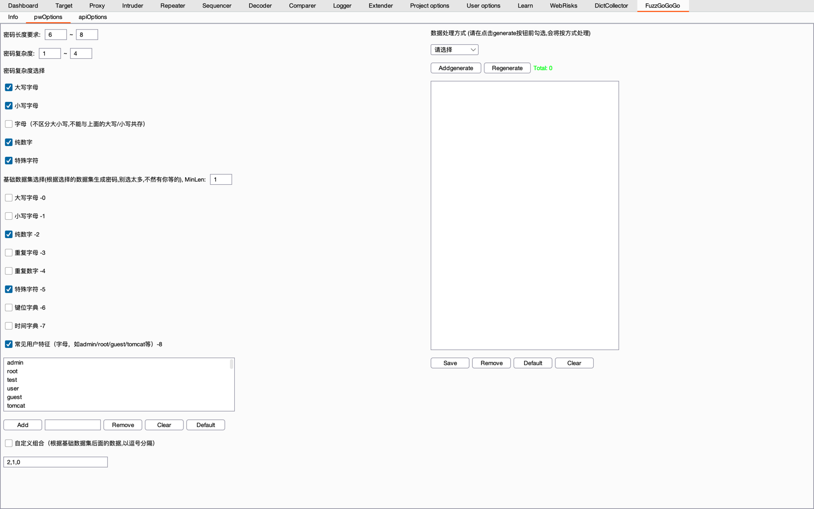
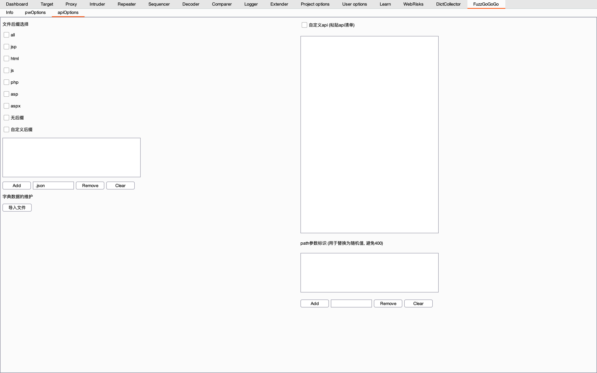
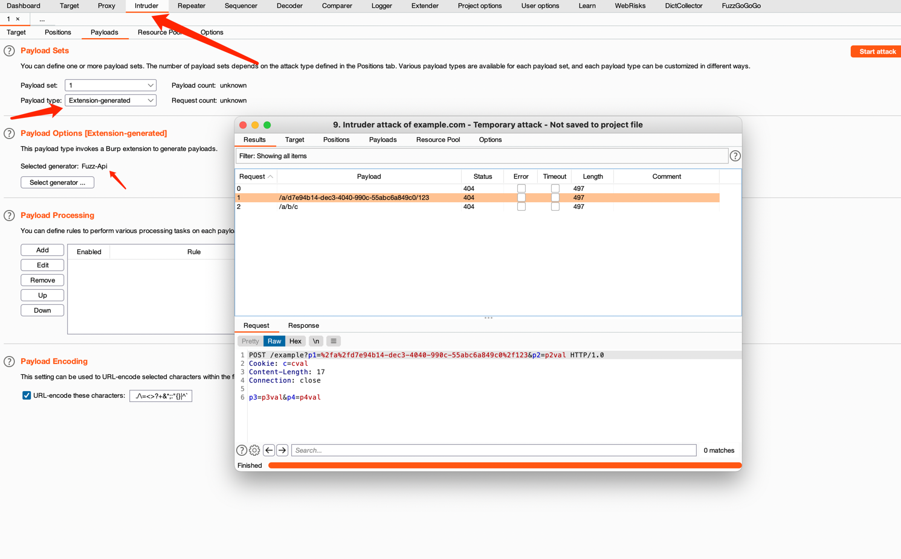

# Intruder Payload Generator
主要是解决我日常爆破时字典的需要，收集的字典数据太多了，有时想要指定特征的爆破字典就要自己手撸，
所以就想着写个插件了，可以自己通过配置生成字典了，
未来会持续写，把日常可能使用到的都实现了，主要是太烂了。
## Password
密码字典生成器，先看个配置界面吧

配置解读
- 1.密码长度要求：不能理解我也办法了
- 2.密码复杂度：指定复杂度的范围，一般密码要求就是"字母/数字/特殊字符的两种及以上组合"，那范围就是2～3
- 3.密码复杂度选择：打开密码复杂度的检测开关，如果不开，但又要这部分数据的话，你就yy吧
- 4.基础数据集选择：也就是参与组合的基础数据，比如我就想要大写/小写字母，那就勾选，然后组合就会拿这两个数据集进行排列组合
- 4.1 MinLen：上面基础数据集数据的最小长度，比如大写字母，MinLen为2，那生成的就是ab/bcd/cdef等，最小长度是2
- 4.2 常见用户特征：这里会内置一些常见的特征，用于生成密码，很常见的就是'admin@123'，可新增删除
- 4.3 自定义组合：就是字面意思自定义，比如我想生成admin@123这样格式的密码，那就根据基础数据集的index进行组合（index在每类数据集的末尾）
- 5.选择对生成数据的处理，比如首字母大写
- 6.按钮Genrate：根据配置生成密码字典，但是生成的结果会追加到末尾
- 7.按钮Regenrate：就翻译意思，重新生成，相比Genrate，会清空已有的数据
- 8.展示生成的数据
- 8.1 按钮Save：保存数据到文件
- 8.2 按钮Remove/Clear，就是删除选中及清空数据
- 8.3 按钮Default，是加载内置的密码字典

### 注意
1.生成预期尽量精确，因为生成太多数据的话，内存会撑不住的，然后Boom哇～

2.推荐使用方式：'自定义组合'模式，再按钮'Genrate'准确生成追加，数据没那么大

3.当然你想咋用都可以，反正挂的不是我的工具

## Api
为啥搞这个？不是有很多api枚举的工具么！！比如dirsearch

1.因为我枚举出来后只知道url，我想知道请求响应的内容，还必须得自己请求访问一遍-_-||

2.我想重放请求，还得再抓包一次-_-||

所以你说我为啥搞呢～
### 功能设计构思
1.提供api的字典
- 1.1 勾选后缀，选择字典数据

2.就是经常会从js中撸出一些api，然后又得手工一个个访问请求看看，能否直接贴上，然后自动跑了（path参数变量需要替换，可能会有多个）
- 2.1 多行输入（用于粘贴复制的url）- 组件JTextArea
- 2.2 添加path参数的标识（从粘贴的url中识别）- 组件JList

### 说明书
看UI吧

配置解读
- 后缀选择：就没啥好解释了，会根据选择的后缀筛选数据
- 无后缀：就是没有后缀的清空，一般是后端api是这样的
- 自定义后缀：那防止出现我没有列出来的啊，那就靠你自己yy加进去
- 自定义api：很常会从js中扒拉出一些api，那一个个验证太慢了，直接贴进去，然后爆破任务去验证就好了
- path参数标识：有一种参数叫path参数，js中的一般会有个path参数标识，比如/admin/:id/user info，查询某id用户的信息，那如果你请求的时候不替换有可能会400,所以替换随机值
- 导入文件，插件会落地内置的字典数据到本地，方便新增，而这个按钮是为了方便整合数据的，去重合并

### 使用及效果
常规Intruder的使用，选择拓展的生成器即可

非常愉快，即能批量验证，还能查看请求及响应，最重要的还是可以直接选中喜欢的请求去重放了

### 注意
因为会加载一个字典数据，所以启动会慢一点，因为在筛选数据呢，稍等一下吧

# 未来规划
## Username
提供用户名的字典
## Host
提供域名字典